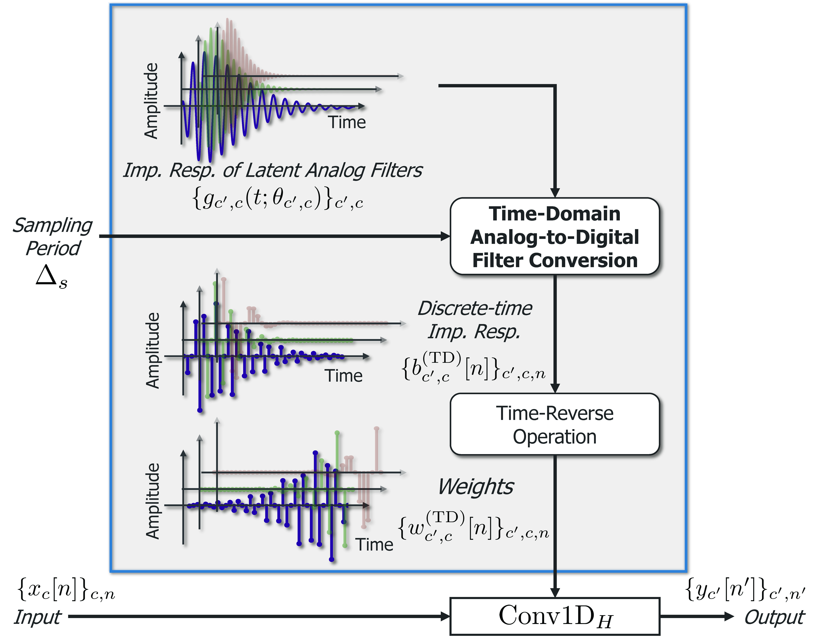
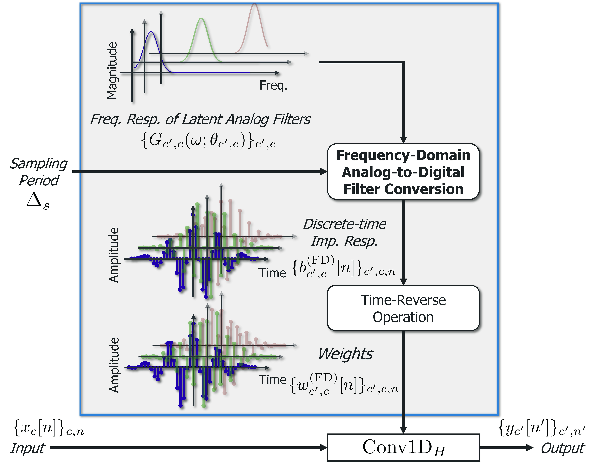

# Sampling-frequency-independent (SFI) convolutional layer and its application to audio source separation

[**Paper**](https://doi.org/10.1109/TASLP.2022.3203907)
| [**Demo**](https://tomohikonakamura.github.io/Tomohiko-Nakamura/demo/sfi_convtasnet)

This repository is an official implementation of our paper entitled "Sampling-frequency-independent convolutional layer and its application to audio source separation".

## Abstract
Audio source separation is often used for the preprocessing of various tasks, and one of its ultimate goals is to construct a single versatile preprocessor that can handle every variety of audio signal. One of the most important varieties of the discrete-time audio signal is sampling frequency. Since it is usually task-specific, the versatile preprocessor must handle all the sampling frequencies required by the possible downstream tasks. However, conventional models based on deep neural networks (DNNs) are not designed for handling a variety of sampling frequencies. Thus, for unseen sampling frequencies, they may not work appropriately. In this paper, we propose sampling-frequency-independent (SFI) convolutional layers capable of handling various sampling frequencies. The core idea of the proposed layers comes from our finding that a convolutional layer can be viewed as a collection of digital filters and inherently depends on sampling frequency. To overcome this dependency, we propose an SFI structure that features analog filters and generates weights of a convolutional layer from the analog filters. By utilizing time- and frequency-domain analog-to-digital filter conversion techniques, we can adapt the convolutional layer for various sampling frequencies. As an example application, we construct an SFI version of a conventional source separation network. Through music source separation experiments, we show that the proposed layers enable separation networks to consistently work well for unseen sampling frequencies in objective and perceptual separation qualities. We also demonstrate that the proposed method outperforms a conventional method based on signal resampling when the sampling frequencies of input signals are significantly lower than the trained sampling frequency.

<p align="center">
  
  
</p>
The left and right panels of the above figure are the proposed SFI convolutional layers using time- and frequency-domain filter design method, respectively.

# Getting started
## Setup
You can setup with conda or docker.

### conda
- Install [miniconda](https://docs.conda.io/en/latest/miniconda.html).
- Create an enviroment for this repository.
  ```bash
  conda env create -f environment-cuda.yml
  ```
- Go into the created environment.
  ```bash
  conda activate sfi
  ```

### docker
- Rewrite `volumes` in `docker-compose.yaml` in accordance with your environment.
  ```yaml
  volumes: 
    - /path/to/this/directory:/opt/src
  ```
- Construct docker container using docker-compose
  ```bash
  docker-compose build
  docker-compose up -d
  ```
- Go into the created container
  ```
  docker-compose exec sfi_convtasnet bash
  ```

## Separating signals
- Execute `separate_audiofile.py`.
  - Use the proposed SFI mechanism.
    ```bash
    python separate_audiofile.py --model_dir /path/to/trained/model/dir --input_files /path/to/audio/file --sample_rate 8000 --output_dir /path/to/output/dir
    ```
  - Use signal resampling.
    ```bash
    python separate_audiofile.py --model_dir /path/to/trained/model/dir --input_files /path/to/audio/file --sample_rate 8000 --output_dir /path/to/output/dir --use_signal_resampling
    ```

# Train model
## Training 
- Download MUSDB18-HQ dataset
- Create training data files from wav files
  - Use `utility/data_generator.py`
    ```bash
    python utility/data_generator.py --musdb_path /path/to/musdb18-hq/dataset --outdir data --is_wav
    # If --setup_file is not set, use default training/validation data split.
    ```
  - Trainining and validation data are created as `data/train_32` and `data/validation_32`. (32 kHz-sampled data)
  - c.f., Usage
    ```
    usage: data_generator.py [-h] --musdb_path MUSDB_PATH [--setup_file SETUP_FILE] --outdir OUTDIR [--n_threads N_THREADS] [--is_wav]

    optional arguments:
      -h, --help            show this help message and exit
      --musdb_path MUSDB_PATH
                            Path to the MUSDB18 dataset.
      --setup_file SETUP_FILE
      --outdir OUTDIR
      --n_threads N_THREADS
      --is_wav
    ```
- Train Model (4 GPUs recommended)
  - Train model with some options (we use the hydra library)
  ```
  python train.py model=MODEL_NAME [any other options]
  ```

### Evaluation
- Prepare the test data and the trained model.
- Run evaluate_specified_sampling_rate.py

# How to cite
```
@article{KSaito2022IEEEACMTASLP,
 author={Saito, Koichi and Nakamura, Tomohiko and Yatabe, Kohei and Saruwatari, Hiroshi},
 journal = {IEEE/ACM Transactions on Audio, Speech, and Language Processing},
 title = {Sampling-frequency-independent convolutional layer and its application to audio source separation},
 year=2022,
 month=sep,
 volume=30,
 pages={2928--2943},
 doi={10.1109/TASLP.2022.3203907}
}
```

# License
[MIT License](LICENSE)

# Achknowledgements
- This work was supported by JSPS KAKENHI under Grant JP20K19818 and JST ACT-X under Grant JPMJAX210G.
- Most part of this code is borrowed from https://github.com/pfnet-research/meta-tasnet.
